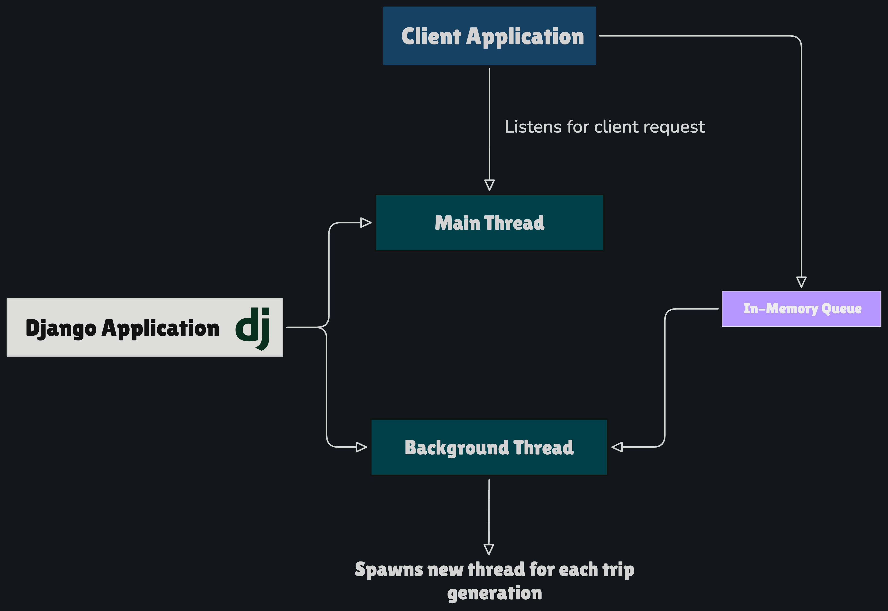
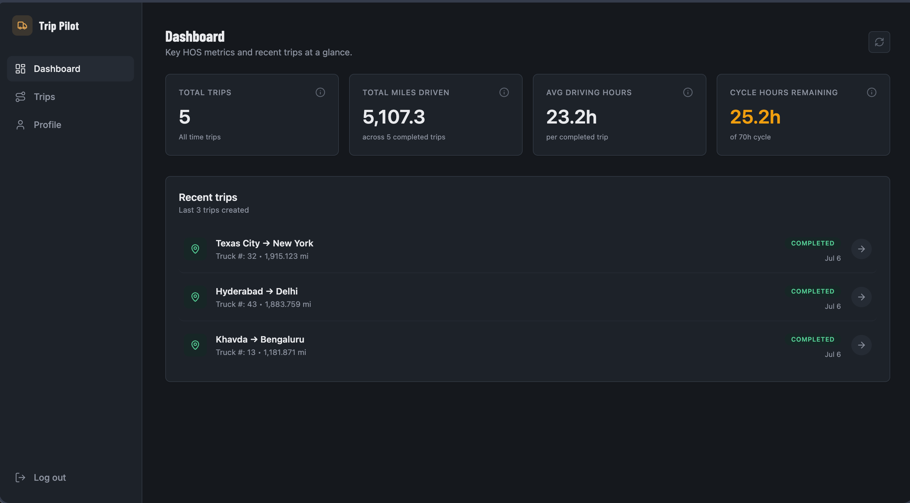
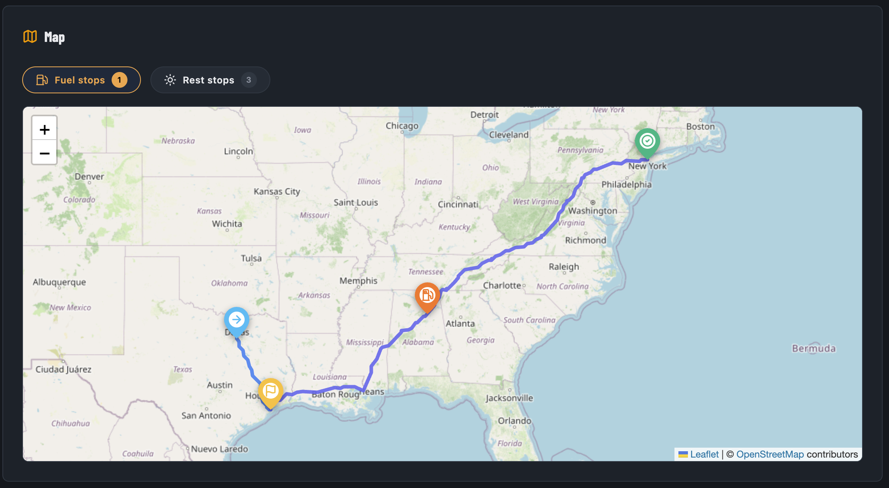
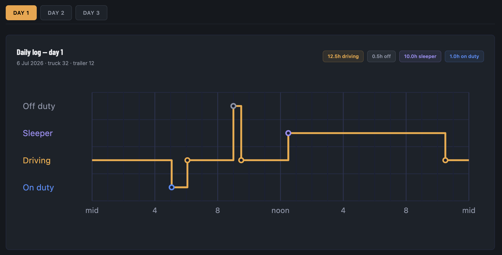

# Trip Pilot

[](https://react.dev/) [](https://vite.dev/) [](https://djangoproject.com/) [](https://www.django-rest-framework.org/) [](https://www.python.org/) [](https://www.typescriptlang.org/) [](https://tailwindcss.com/) [](https://www.postgresql.org/) [](https://www.docker.com/)

A modern, responsive Hours-of-Service (HOS) routing engine and electronic logging device (ELD) daily log generator designed to streamline route planning and compliance for commercial truck drivers.

---

## 🚀 Live Demo

- **Link**: [https://truck-eld.vercel.app/](https://truck-eld.vercel.app/)  
- Demo Credentials:
   ```bash
   email: demo-user@gmail.com
   password: 12345678
   ```

## 🛠️ Technology Stack

### Frontend

- **Framework**: React 19 + Vite
- **Language**: TypeScript
- **Styling**: Tailwind CSS
- **Routing**: React Router DOM v7
- **Mapping**: Leaflet + React Leaflet
- **Icons**: Lucide React
- **Toast Notifications**: Sonner
- **Build Tool**: Vite

### Backend

- **Framework**: Django 5.x + Django REST Framework (DRF)
- **Language**: Python 3.12+
- **Database**: PostgreSQL
- **Routing API**: GraphHopper API (for route calculation and polyline encoding)
- **Authentication**: JWT (SimpleJWT)
- **Task Queue**: In-memory background job queue thread (worker for route simulation and ELD sheet aggregation)
- **Containerization**: Docker & Docker Compose

---

## 📐 Architecture

- The application is built upon the client-server architecture. The client sends the HTTP requests and server processes it.
- The Django is synchronous using native python WSGI web server. The entire generation pipeline runs in separate background thread which makes the application non-blocking.  
- A background native python in-memory queue with backgroun worker is implemented for handling multiple trip generation request concurrently.

<p align="center">
    
    <i>Server Architecture</i>
</p>


## Features

### 🔐 Authentication & Session Persistence

- Secure JWT-based driver login.
- Access and Refresh token lifecycle management with proactive automatic background refresh.
- Driver-scoped data isolation (drivers only view, create, or delete their own trips).

### 📊 Dashboard & HOS Metrics

- **Real-time Metrics**: Displays calculated driver statistics:
  - **Total Trips**: Total count of active trips.
  - **Total Miles Driven**: Sum of miles completed.
  - **Average Driving Hours**: Average driving duration per completed trip.
  - **Cycle Hours Remaining**: Driver's available hours in the rolling 70-hour / 8-day cycle (automatically updated by completed logs).
- **Metric Tooltips**: Informational popover tooltips on hovering the info icon to explain the calculation basis of each metric.
- **Recent Trips List**: Visual summary of the 3 most recently created trips, color-coded by execution status (Completed, In progress, Failed).

<p align="center">
    <!-- Place dashboard screenshot here -->
    
    <i>Dashboard Page</i>
</p>

### 🗺️ Route Simulation & Map Visualizations

- Interactive Leaflet maps rendering encoded polyline routes, start locations, pickups, and drop-offs.
- Seamless route calculation using real geographic coordinates, calculating distances and speeds.

<p align="center">
    <!-- Place dashboard screenshot here -->
    
    <i>Interactive Map With Stops</i>
</p>

### ⏱️ Hours-of-Service (HOS) Calculation Engine

- Simulates real-time commercial driver requirements:
  - 11-Hour Driving Limit.
  - 14-Hour On-Duty limit.
  - 30-Minute mandatory rest breaks after 8 consecutive hours of driving.
  - 34-Hour restart rest periods.
- Automatically inserts fuel stops, mandatory rest breaks, and sleeper-berth resets along the generated route paths.

### 📋 ELD Daily Log Generator

- Translates raw trip logs into FMCSA-compliant 24-hour grid sheets.
- Automatically handles midnight-crossing duty logs by splitting segments proportionally.
- Tallies cumulative Off-duty, Sleeper berth, Driving, and On-duty hours to sum to exactly 24.0 hours per day.
- Identifies and flags HOS violations.

<p align="center">
    <!-- Place dashboard screenshot here -->
    
    <i>ELD Log Graph</i>
</p>

### 🗑️ Soft-Delete Control

- Safe deletion option on trip cards that soft-deletes trips in the database and instantly updates the dashboard analytics.

---

## 📦 Project Structure

```bash
.
├── backend
│   ├── common              # Core helper classes, models, & custom exceptions
│   ├── config              # Django configuration files, settings, and root URLs
│   ├── services            # HOS simulation engine, ELD generator, and route fetchers
│   ├── trips               # Trip management application (models, views, APIs, serialization)
│   ├── user                # Custom User model and driver registration
│   ├── manage.py
│   ├── pyproject.toml
│   └── Dockerfile
├── frontend
│   ├── src
│   │   ├── app             # React application config and router mapping
│   │   ├── components      # Interactive layouts, modals, and list cards
│   │   ├── constants       # Navigation paths and metric descriptions
│   │   ├── context         # Auth state providers
│   │   ├── hooks           # Custom React hooks
│   │   ├── network         # Axios API clients and network call abstractions
│   │   ├── pages           # Main page layouts (Dashboard, Trips, Profile, Trip Detail)
│   │   ├── types           # TypeScript definitions
│   │   └── utils           # Value formatting and map calculation utilities
│   ├── package.json
│   └── vite.config.ts
└── docker-compose.yml
```

---

## 🚀 Getting Started

### Prerequisites

- Node.js v18+
- Python 3.12+ (or UV package manager)
- PostgreSQL
- [GraphHopper API Key](https://www.graphhopper.com/) (required for routing calculations)

### Local Environment Configuration

1. **Frontend** (`.env` in `/frontend`):

   ```env
   VITE_API_BASE_URL=http://localhost:8000
   ```

2. **Backend** (`.env` in `/backend`):

   ```env
   ORIGIN_URL=http://localhost:5173
   ALLOWED_HOSTS=localhost,127.0.0.1

   DB_NAME=db
   DB_USER=user
   DB_PASSWORD=password
   DB_HOST=host
   DB_PORT=24274

   JWT_ACCESS_TOKEN_MINUTE=15
   JWT_REFRESH_TOKEN_DAYS=7

   STAGE=dev or prod
   JWT_SECRET=strong_secret
   GRAPHHOPPER_API_KEY="api_key_generate_from_dashboard"
   ```

### Quick Start (Local Setup)

1. **Clone the repository**:

   ```bash
   git clone https://github.com/Shoyeb45/trip-pilot.git
   cd trip-pilot
   ```

2. **Start the Backend**:

   ```bash
   cd backend
   # Create and activate virtual environment
   python -m venv .venv
   source .venv/bin/activate
   pip install -e .

   # Run database migrations
   python manage.py migrate

   # Start the server
   python manage.py runserver
   ```

3. **Start the Frontend**:

   ```bash
   cd ../frontend
   npm install
   npm run dev
   ```

4. Open [http://localhost:5173](http://localhost:5173) in your browser.

---

## 🐳 Docker Support

The docker image for the backend can be built by following command:

```bash
# build image
docker build -t backend-app .

# run image
docker run -p 8000:8000 --env-file .env backend-app
```

---

## 📄 License

Distributed under the **MIT License**.
